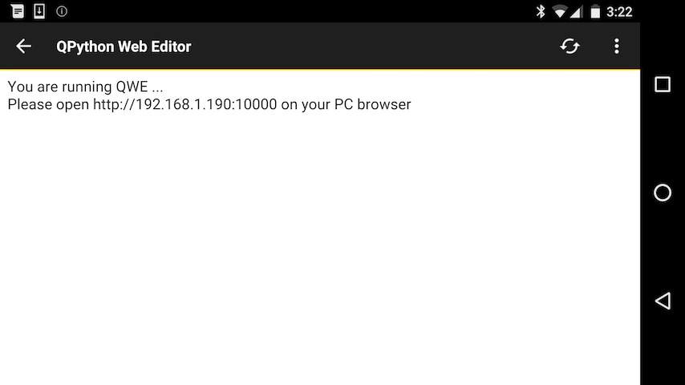
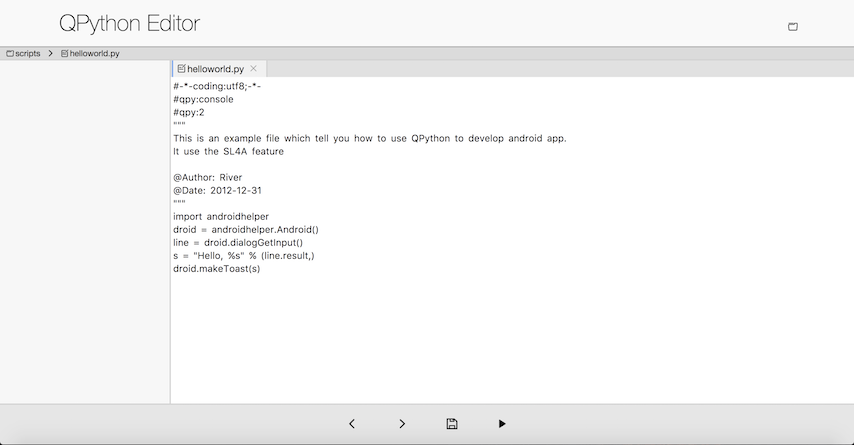

# Use the best way for developing

## Develop from QEditor

QEditor is the QPython's built-in editor, which supports Python / HTML syntax highlight.

**QEditor's main features**

* Edit / View plain text file, like Python, Lua, HTML, Javascript and so on

* Edit and run Python script & Python syntax highlight

* Edit and run Shell script

* Preview HTML with built-in HTML browser

* Search by keyword, code snippets, code share

You could run the QPython script directly when you develop from QEditor, so when you are moving it's the most convient way for QPython develop.

## Develop from browser

QPython has a built-in script which is **qedit4web.py**, you could see it when you click the start button and choose  "Run local script".
After run it, you could see the result.

Then, you could access the url from your PC/Laptop's browser for developing, just like the below pics.

*After choose some project or script, you could start to develop*

With it's help, you could write from browser and run from your android phone. It is very convenient.

## Develop from your computer

Besides the methods mentioned above, you can also develop the script in your own way, then upload it to your phone using the built-in FTP service and run it with QPython.