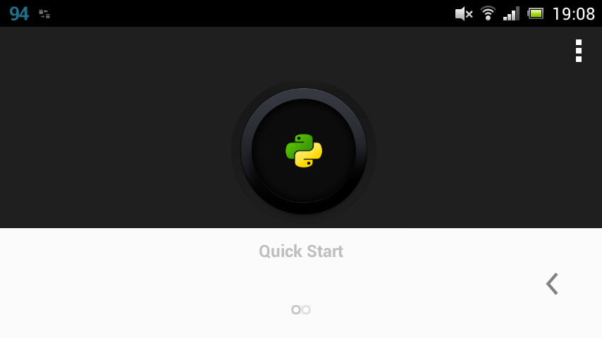
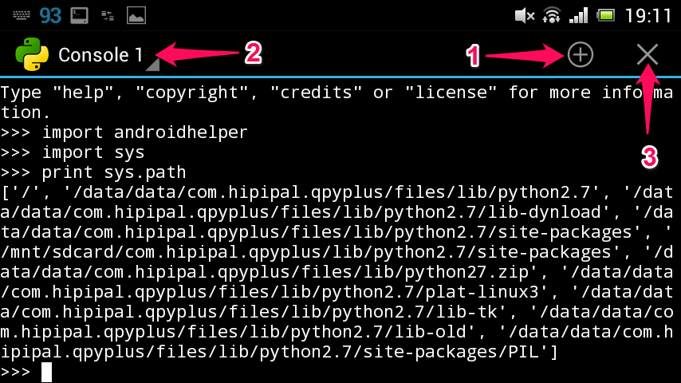
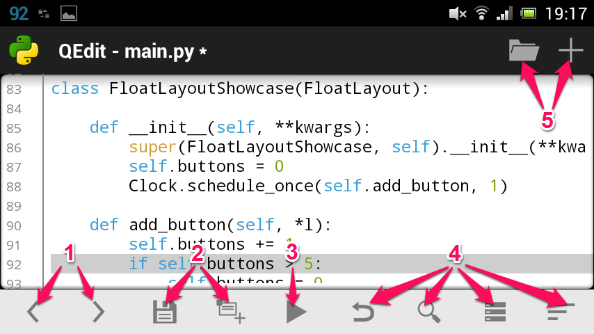

# QPython: Getting Started Guide

This guide will introduce QPython's features and help you get started quickly.

## QPython Overview

**Why choose QPython?**

The smartphone is becoming people's essential information & technical assistant, so a flexible script engine could help people complete most jobs efficiently without complex development.

QPython offers **an amazing developing experience** - with its help, you could implement programs easily without complex IDE installation, compiling, or packaging processes.

### QPython Branches

For different usage scenarios, QPython has several branches:

- **[QPython - IDE for Python & AI](qpython-x.md)** - The main version with AI features, available on Google Play and app stores
- **[QPython+ - Python for Android](qpython-x.md)** - Community open-source version for contributors
- **[QPython Plus](qpython-x.md)** - Extended permissions version (not on app stores)

### Key Features

- **Offline Python 3.12 interpreter** - No Internet required to run Python programs
- **Multiple runtime modes** - Console, SL4A, Kivy GUI, WebApp, and background (QScript) modes
- **SL4A Integration** - Control Android hardware and APIs with Python
- **Package Installation** - QPYPI and pip support for extending capabilities
- **Built-in Editor** - Syntax highlighting and code editing
- **QR Code Support** - Easy code sharing and distribution

---

## 1. Dashboard



After you install QPython, start it by tapping its icon. You will see the main dashboard with the QPython logo and the following features:

### Dashboard Features

The QPython dashboard provides quick access to all major features:

* **Terminal** — Access the Python console and shell for direct command execution
* **Notebook** — Interactive Jupyter-style notebooks for data analysis and experiments
* **Editor** — Built-in code editor with syntax highlighting for writing Python scripts
* **Explorer** — Browse and manage your files, scripts, and projects
* **QPYPI** — Install Python packages and extensions. See [QPYPI Guide](qpypi-guide.md) for details
* **Setting** — Configure QPython preferences and runtime options
* **Community** — Access QPython community resources, forums, and help
* **Courses** — Access learning materials and tutorials for Python programming

Tap any icon to access the corresponding feature.

---

## 2. Terminal and Editor

### Terminal



The Terminal provides a Python console where you can:
- Explore object properties
- Test syntax and ideas
- Execute commands directly

Open additional Terminal tabs with the plus button (1), switch between them from the dropdown (2), and close with the close button (3).


A notification will remain in the notification bar while the Terminal is running. Tap it to return to the Terminal.

### Editor



The editor features:
- Python syntax highlighting
- Line numbers
- Indentation control (buttons 1 on toolbar)
- **Save** and **Save As** (buttons 2)
- **Run** (button 3)
- **Undo**, **Search**, **Recent Files**, **Settings**
- **Open** and **New** (top buttons 5)

**Important:** When saving, add `.py` extension manually as the editor doesn't do it automatically.

---

## 3. Explorer (File Management)

Access your scripts and projects through the **Explorer**. Here you can browse, organize, and manage all your Python files.

### Scripts

Scripts are single Python files stored in `/storage/emulated/0/Android/data/org.qpython.qpy/files/scripts3/` (for Python 3).

Available actions:
- **Run** — Execute the script
- **Open** — Edit with built-in editor
- **Rename** — Change the script name
- **Delete** — Remove the script

### Projects

Projects are directories containing `main.py` as the entry point. You can include other dependencies and resources in the same directory. Store projects in `/storage/emulated/0/Android/data/org.qpython.qpy/files/projects3/`.

### Notebooks

Jupyter-style notebooks are also managed through the Explorer, stored in `/storage/emulated/0/Android/data/org.qpython.qpy/files/notebooks/`.

Available actions:
- **Run** — Execute the project
- **Open** — Explore project resources
- **Rename** — Change the project name
- **Delete** — Remove the project

---

## 4. Libraries

Extend QPython's capabilities by installing third-party libraries.

### Package Installation Methods

**QPYPI (Recommended)**

Install pre-built libraries from QPYPI, including scientific packages like numpy, scipy, etc.

See [QPYPI Guide](qpypi-guide.md) for details.

**PIP Client**

Install pure Python libraries through QPython's PIP Client or QPYPI dashboard:

```bash
pip install requests
```

**Pre-compiled Packages**

For packages with C/C++/Rust dependencies, use QPython's pre-compiled packages:

```bash
pip install numpy-qpython
pip install scipy-aipy
```

See [QPYPI Guide](qpypi-guide.md) for the full list of available packages.

**Manual Installation**

You can also copy libraries to `/storage/emulated/0/Android/data/org.qpython.qpy/files/lib/python3.12/site-packages/`.

---

## 5. Runtime Modes

QPython supports several runtime modes for different use cases:

### Console Mode

Default mode for regular Python scripts.

### SL4A Mode

Scripts using Android APIs through the SL4A library.

```python
import androidhelper

droid = androidhelper.Android()
droid.makeToast('Hello Android!')
```

See [QSL4A Documentation](qsl4a/index.md) for full API reference.

### WebApp Mode

Create web-based applications with a backend server.

Add headers to your script:
```python
#qpy:webapp:Hello QPython
#qpy://localhost:8080/hello

from bottle import route, run, Bottle

app = Bottle()

@route('/hello')
def hello():
    return '<h1>Hello from QPython!</h1>'

run(app, host='localhost', port=8080)
```

### Q Mode (Background)

Run scripts without UI in the background.

Add header:
```python
#qpy:qpyapp

import time

while True:
    # Your background task
    time.sleep(60)
```

---

## 6. Community and Support

Visit [QPython.org](http://qpython.org) for:
- Documentation
- User communities
- Help and Q&A

**Community Links:**
- [Facebook Group](https://www.facebook.com/groups/qpython)
- [GitHub](https://github.com/qpython-android/qpython)
- [Report Issues](https://github.com/qpython-android/qpython/issues)

**Next Steps:**
- Try the [Hello World Tutorial](tutorial-hello-world.md)
- Explore [QSL4A API](qsl4a/index.md) for Android integration
- Learn about [QPython Branches](qpython-x.md)

---

*Thanks to dmych for the original draft on [his blog](http://onetimeblog.logdown.com/posts/2014/01/22/qpython-how-to-start)*
