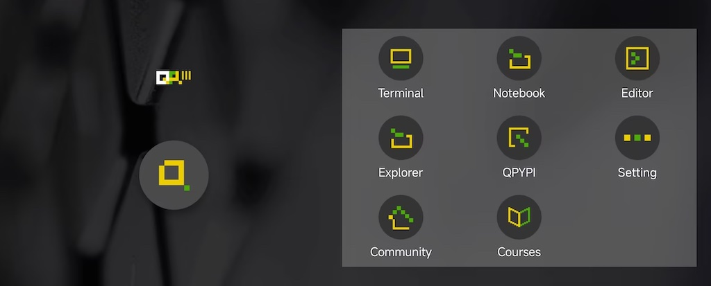
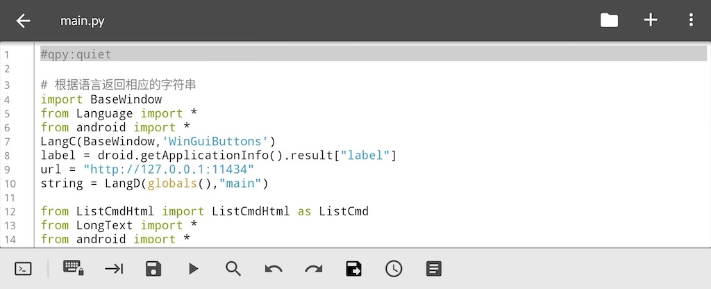

# QPython: Getting Started Guide

This guide will introduce QPython's features and help you get started quickly.

## QPython Overview

**Why choose QPython?**

Smartphones have become essential information and technical assistants. A flexible interpreter engine helps you efficiently complete most tasks without complex development processes.

QPython offers **an amazing developing experience** - with its help, you could implement programs easily without complex IDE installation, compiling, or packaging processes.

### QPython Branches

For different usage scenarios, QPython has several branches:

- **[QPython](qpython-x.md)** – The main version maintained by the QPython team with AI features, available on Google Play and other app stores
- **[QPython+](qpython-x.md)** – Community version launched by open-source contributors, offering various new features
- **[QPython Plus](qpython-x.md)** – Extended permissions version (not available on app stores)

### Key Features

- **Offline Python 3.12 interpreter** - Run Python programs without Internet
- **SL4A Integration** - Control Android hardware and APIs with Python
- **GenAI Integration** - Support for local LLM, various LLM libraries including OpenAI, and AIPyApp for Vibe Coding development on QPython
- **Package Installation** - Install extensions via QPYPI and pip
- **Built-in Editor** - Syntax highlighting and code editing
- **Multiple Runtime Modes** - Besides console programs, supports Android native UI (via SL4A interface), Pygame / Turtle / Tkinter and other runtime modes

---

## 1. Dashboard



After you install QPython, start it by tapping its icon. You will see the main dashboard with the QPython logo and the following features:

### Dashboard Features

The QPython dashboard provides quick access to all major features:

* **Terminal** — Access the Python console and shell for direct command execution
* **Notebook** — Interactive Jupyter-style notebooks for data analysis and experiments
* **Editor** — Built-in code editor with syntax highlighting for writing Python scripts
* **Explorer** — Browse and manage your files, scripts, and projects
* **QPYPI** — Install Python packages and extensions. See [QPYPI Guide](qpypi-guide.md) for details
* **Setting** — Configure QPython preferences and runtime options
* **Community** — Access QPython community resources, forums, and help
* **Courses** — Access learning materials and tutorials for Python programming

Tap any icon to access the corresponding feature.

---

## 2. Terminal and Editor

### Terminal


The Terminal provides a Python console with:
- Explore object properties
- Test syntax and ideas
- Execute commands directly

Use the plus button (1) to open new Terminal tabs, switch between them via the dropdown (2), and close with the close button (3).

### Editor



The editor's bottom toolbar contains the following tools (left to right):

- Quick Input (includes keywords like def / if / else / elif / class)
- Lock (prevent accidental touches)
- Jump
- Save
- Run
- Search
- Undo
- Redo
- Save As
- Recent Files
- Code Snippets

**Important:** When saving, manually add the `.py` extension as the editor doesn't add it automatically.

---

## 3. Explorer (File Management)

Access scripts and projects through the **Explorer**, supporting browsing, organizing, and managing all Python files.

### Scripts

Scripts are single Python files stored in `/storage/emulated/0/Android/data/org.qpython.qpy/files/scripts3/` (for Python 3).

Available actions:
- **Run** — Execute the script
- **Open** — Edit with built-in editor
- **Rename** — Change the script name
- **Delete** — Remove the script

### Projects

Projects are directories containing `main.py` as the entry point. You can include other dependencies and resources in the same directory. Store projects in `/storage/emulated/0/Android/data/org.qpython.qpy/files/projects3/`.

### Notebooks

Jupyter-style notebooks are also managed through the Explorer, stored in `/storage/emulated/0/Android/data/org.qpython.qpy/files/notebooks/`.

Available actions:
- **Run** — Execute the notebook
- **Open** — Explore notebook content
- **Rename** — Change the notebook name
- **Delete** — Remove the notebook

---

## 4. Libraries

Extend QPython's capabilities by installing third-party libraries.

### Package Installation Methods

**QPYPI (Recommended)**

Install pre-built libraries from QPYPI, including scientific packages like numpy, scipy, etc.

See [QPYPI Guide](qpypi-guide.md) for details.

**PIP Client**

Install pure Python libraries through QPython's PIP client or QPYPI interface:

```bash
pip install requests
```

**Pre-compiled Packages**

For packages with C/C++/Rust dependencies, use QPython's pre-compiled packages:

```bash
pip install numpy-qpython
pip install scipy-aipy
```

See [QPYPI Guide](qpypi-guide.md) for the full list of available packages.

**Manual Installation**

You can also copy libraries to `/storage/emulated/0/Android/data/org.qpython.qpy/files/lib/python3.12/site-packages/`.

---

## 5. Runtime Modes

QPython supports several runtime modes for different use cases:

### Console Mode

Default mode for regular Python scripts.

### SL4A Mode

Scripts that call Android APIs through the SL4A library.

```python
import androidhelper

droid = androidhelper.Android()
droid.makeToast('Hello Android!')
```

See [QSL4A Documentation](qsl4a/index.md) for full API reference.

### WebApp Mode

Create web-based applications with a backend server. Add the following two headers at the beginning of your script:

```python
#qpy:webapp:<project name>
#qpy://localhost:<port the web service listens on>/<default main path>
```

Example:
```python
#qpy:webapp:Hello QPython
#qpy://localhost:8080/hello

from bottle import route, run, Bottle

app = Bottle()

@route('/hello')
def hello():
    return '<h1>Hello from QPython!</h1>'

run(app, host='localhost', port=8080)
```

### Q Mode (Quiet Mode)

Run scripts silently without displaying the console. Add header at the beginning of your script:
```python
#qpy:quiet

import time

while True:
    # Your background task
    time.sleep(60)
```
If you need to run a GUI-based SL4A program and don't want to show console information, this mode is recommended.

---

## 6. Community and Support

Visit [QPython.org](http://qpython.org) for documentation, user communities, and help.

**Community Links:**
- [Facebook Group](https://www.facebook.com/groups/qpython)
- [GitHub](https://github.com/qpython-android/qpython)
- [Report Issues](https://github.com/qpython-android/qpython/issues)

**Next Steps:**
- Try the [Hello World Tutorial](tutorial-hello-world.md)
- Explore [QSL4A API](qsl4a/index.md) for Android integration
- Learn about [QPython Branches](qpython-x.md)

---

## Video Introduction

<iframe width="560" height="315" src="https://www.youtube.com/embed/GxdWpm3T97c?si=zQzPE7yc4ErmhLOK" title="YouTube video player" frameborder="0" allow="accelerometer; autoplay; clipboard-write; encrypted-media; gyroscope; picture-in-picture; web-share" referrerpolicy="strict-origin-when-cross-origin" allowfullscreen></iframe>

## Next Steps

If you've got a basic understanding of QPython's features, welcome to start experiencing the fun of programming! Try the [Hello World Tutorial](/en/tutorial-hello-world/) to take your first step.

