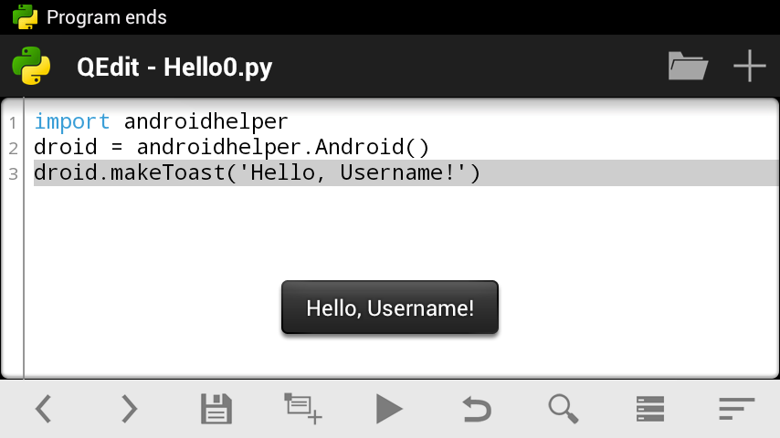

# Writing "Hello World"

## Hello world



Well, after you became a bit more familiar with QPython, let's create our first program in QPython. Obviously, it will be `helloworld.py`. ;)

Start QPython, open editor and enter the following code:

```python
import androidhelper

droid = androidhelper.Android()
droid.makeToast('Hello, Username!')
```

No wonder, it's just similar to any other hello-world program. When executed, it just shows pop-up message on the screen (see screenshot on the top). Anyway, it's a good example of QPython program.

## SL4A library

It begins with *import androidhelper* — the most useful module in QPython, which encapsulates almost all interface with Android, available in Python. Any script developed in QPython starts with this statement (at least if it claims to communicate with user). Read more about Python library [here](https://docs.python.org/3.12/library/index.html) and import statement [here](https://docs.python.org/3.12/reference/simple_stmts.html#import).

By the way, if you're going to make your script compatible with SL4A, you should replace the first line with the following code (and use `android` instead `androidhelper` further in the program):

```python
try:
    import androidhelper as android
except ImportError:
    import android
```

Ok, next we're creating an object `droid` (actually a class), it is necessary to call RPC functions in order to communicate with Android.

And the last line of our code calls such function, `droid.makeToast()`, which shows a small pop-up message (a "toast") on the screen.

Well, let's add some more functionality. Let it ask the user name and greet them.

## More samples

We can display a simple dialog box with the title, prompt, edit field and buttons **Ok** and **Cancel** using `dialogGetInput` call. Replace the last line of your code and save it as `hello1.py`:

```python
import androidhelper

droid = androidhelper.Android()
respond = droid.dialogGetInput("Hello", "What is your name?")
```

Well, I think it should return any respond, any user reaction. That's why I wrote `respond = ...`. But what the call actually returns? Let's check. Just add print statement after the last line:

```python
import androidhelper

droid = androidhelper.Android()
respond = droid.dialogGetInput("Hello", "What is your name?")
print(respond)
```

Then save and run it...

Oops! Nothing printed? Don't worry. Just pull notification bar and you will see "QPython Program Output: hello1.py" — tap it!

As you can see, `droid.dialogGetInput()` returns a JSON object with three fields. We need only one — `result` which contains an actual input from user.

Let's add script's reaction:

```python
import androidhelper

droid = androidhelper.Android()
respond = droid.dialogGetInput("Hello", "What is your name?")
print(respond)
message = f'Hello, {respond.result}!'
droid.makeToast(message)
```

Last two lines (1) format the message and (2) show the message to the user in the toast. See [Python docs](https://docs.python.org/3.12/tutorial/inputoutput.html#fancier-output-formatting) if you still don't know what f-strings mean.

Wow! It works! ;)

Now I'm going to add a bit of logic there. Think: what happen if the user clicks **Cancel** button, or clicks **Ok** leaving the input field blank?

You can play with the program checking what contains `respond` variable in every case.

First of all, I want to put text entered by user to a separate variable: `name = respond.result`. Then I'm going to check it, and if it contains any real text, it will be considered as a name and will be used in greeting. Otherwise another message will be shown. Replace fifth line `message = f'Hello, {respond.result}!'` with the following code:

```python
name = respond.result
if name:
    message = f'Hello, {name}!'
else:
    message = "Hey! And you're not very polite, %Username%!"
```

Use **<** and **>** buttons on the toolbar to indent/unindent lines in if-statement (or just use space/backspace keys). You can read more about indentation in Python [here](https://docs.python.org/3.12/tutorial/introduction.html#first-steps-towards-programming); if-statement described [here](https://docs.python.org/3.12/tutorial/controlflow.html#if-statements).

First of all, we put user input to the variable `name`. Then we check does `name` contain anything? In case the user left the line blank and clicked **Ok**, the return value is empty string `''`. In case of **Cancel** button pressed, the return value is `None`. Both are treated as false in if-statement. So, only if `name` contains anything meaningful, then-statement is executed and greeting "Hello, ...!" shown. In case of empty input the user will see "Hey! And you're not very polite, %Username%!" message.

Ok, here is the whole program:

```python
import androidhelper

droid = androidhelper.Android()
respond = droid.dialogGetInput("Hello", "What is your name?")
print(respond)
name = respond.result
if name:
    message = f'Hello, {name}!'
else:
    message = "Hey! And you're not very polite, %Username%!"
droid.makeToast(message)
```


## Execution result 

<video src="../static/mov_hellolorld.mp4" controls width="480"></video>
