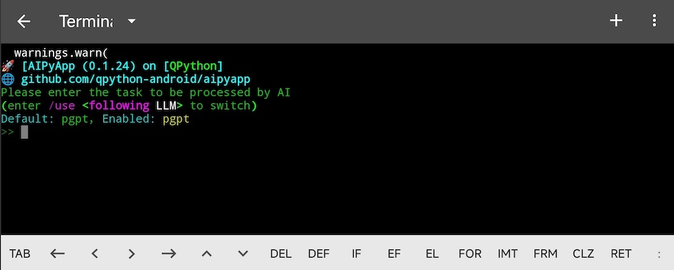

# AIPyApp - AI驱动的程序生成器

AIPyApp 是 QPython 中的智能工具，可以利用 AI 从自然语言指令自动生成 Python 程序。



## 概述

AIPyApp 改变了您编写代码的方式——只需用自然语言描述您想要的功能，AI 就会为您生成 Python 程序。QPython 还将推出 **AIPy Academy**——一个为 AI 时代量身定制的 Python 编程课程平台。

## 安装

### 第一步：从仪表盘启动

1. 打开 QPython，进入 **仪表盘**
2. **长按**开始按钮

如果未安装 AIPyApp，系统会提示您确认安装。按 **回车键**继续。

QPython 将自动从 PYPI 下载并安装所需的依赖项。请耐心等待安装完成。

### 第二步：重新启动 AIPyApp

安装完成后，返回 QPython 仪表盘，再次 **长按**开始按钮启动 AIPyApp。

## 配置

### 设置您的 AI 密钥

首次启动时，您需要提供 AI API 密钥：

1. **在 PGPT 注册**：在 [https://user.pgpt.cloud](https://user.pgpt.cloud) 创建账户以生成您的 AI 密钥
2. **高级选项**：AIPyApp 还支持来自 OpenAI、Deepseek 和其他提供商的自定义 AI 密钥（详见高级教程）

### 输入您的 AI 密钥

1. 长按输入提示
2. 从弹出菜单中选择 **粘贴**
3. 按 **回车键**确认

您的 AI 密钥将保存以供后续会话使用。

## 使用 AIPyApp

配置完成后，您将进入 AIPyApp 控制台模式。只需用自然语言输入您的指令即可！

### 示例命令

尝试输入：

```
使用 QSL4A 创建一个 HELLO QPY 程序作为演示
```

AIPyApp 将：
1. 理解您的自然语言请求
2. 生成相应的 Python 代码
3. 自动执行程序

就是这样——您无需编写任何代码就创建了一个可运行的 Python 程序！

## 演示

上面的示例演示了 AIPyApp 如何：
- 理解中文指令
- 生成基于 QSL4A 的 Python 代码
- 立即运行程序

探索 AIPyApp 以发现更多功能，开始轻松构建 Python 程序。

## 了解更多

敬请期待 **AIPy Academy**：[aipy.org](https://aipy.org) - 在 AI 时代学习和使用 Python 编程的课程即将上线。
