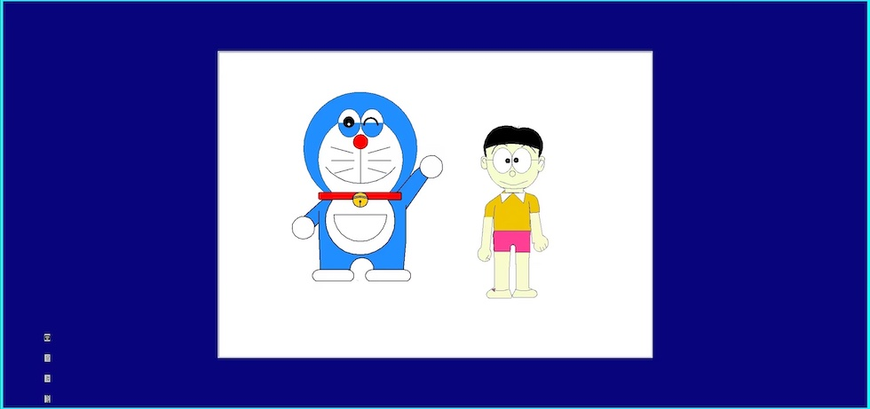

# 图形界面（Turtle 和 Tkinter）

本指南说明如何在 Android 设备上的 QPython 中启用图形界面支持（Turtle 和 Tkinter）。

## 概述

QPython 可以运行 Turtle 和 Tkinter 应用程序，但需要额外的软件来在 Android 上提供图形显示支持。

## 前提条件

开始之前，您需要下载以下资源：

1. **Xserver.apk** - 提供 Turtle/Tkinter 图形支持的配套应用
   - 下载地址：[QPythonProject/Extra on Google Drive](https://www.qpython.org/en/#download-resources)
2. **Turtle & Tkinter QPython 图形界面扩展** - 通过 QPython 的 QPYPI 安装

## 安装步骤

### 第一步：安装 Xserver

从 Google Drive 的 QPython Extra 资源目录下载并安装 Xserver.apk。

### 第二步：安装 QPython 扩展

打开 QPython 并导航到 QPYPI。找到并安装 **Turtle & Tkinter QPython 图形界面** 扩展。

### 第三步：配置 Xserver 电池设置

为防止 Xserver 在后台运行时被杀死：

1. 进入设备的 **设置** > **应用** > **Xserver**
2. 找到 **电池** 设置
3. 将电池管理设置为 **"无限制"** 或 **"不限制"**

这可确保 Xserver 在切换到后台时继续运行。

### 第四步：配置 QPython 电池设置（推荐）

同样，将 QPython 的电池管理设置为 **"无限制"** 以防止进程被终止：

1. 进入 **设置** > **应用** > **QPython**
2. 找到 **电池** 设置
3. 将电池管理设置为 **"无限制"**

### 第五步：启动 Xserver

在运行 Turtle/Tkinter 应用程序之前，启动 Xserver 应用并将其切换为后台运行。

## 运行 Turtle/Tkinter 应用程序

完成设置后：

1. 确保 Xserver 在后台运行
2. 在 QPython 中运行您的 Turtle 或 Tkinter 应用程序
3. 切换到 Xserver 查看图形输出

## 演示程序

您可以从 QPython 应用的 QPYPI 第一个扩展部分下载并尝试 **Turtle 画哆啦A梦** 演示程序来验证您的设置。

## 演示视频

<iframe src="//player.bilibili.com/player.html?isOutside=true&aid=114239066936991&bvid=BV1gEo9YSE4s&cid=29110896171&p=1" scrolling="no" border="0" frameborder="no" framespacing="0" allowfullscreen="true" width="315" height="560"></iframe>
## 故障排除

- **黑屏**：确保在启动应用程序之前 Xserver 正在运行
- **应用程序崩溃**：检查 QPython 和 Xserver 是否都设置了无限制的电池设置
- **无显示**：验证 Turtle/Tkinter 扩展是否通过 QPYPI 正确安装
