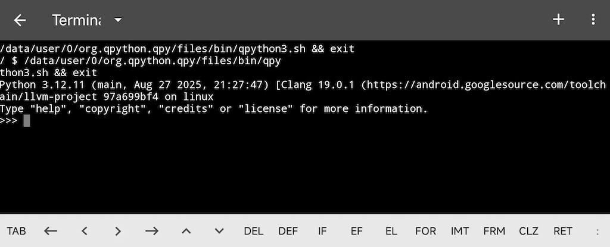

# Terminal - Python 命令行工具

终端是 QPython 中最常用的功能之一。它是一个强大的工具，可用于探索 Python 特性和库、试验新语法以及管理包。



## 概述

QPython 提供多种终端选项以满足不同需求：

- **QPython Shell 终端** – 用于快速探索的标准 Python shell
- **IPython 交互式解释器** – 功能更强大的交互式解释器
- **PIP 客户端** – 用于管理 Python 包的命令行工具

## 访问终端

### 快速访问

1. 打开 QPython 并进入 **仪表盘**
2. **点击**终端图标进入默认的 QPython Shell 终端

### 高级选项（长按）

在仪表盘上，**长按**终端图标以访问其他选项：

- **QPython Shell 终端** – 启动标准 Python shell
- **IPython 交互式解释器** – 启动具有高级功能的 IPython，包括代码补全、语法高亮和命令历史
- **PIP 客户端** – 启动包管理界面

## QPython Shell 终端

QPython Shell 终端提供了一种快速执行 Python 命令和探索 Python 特性的方式。

### 功能

- 即时命令执行
- 基本 Python 解释器功能
- 访问 Python 内置函数和标准库
- 非常适合快速测试和实验

### 使用示例

```python
>>> print("Hello from QPython!")
Hello from QPython!
>>> import math
>>> math.sqrt(16)
4.0
>>> [x**2 for x in range(10)]
[0, 1, 4, 9, 16, 25, 36, 49, 64, 81]
```

## IPython 交互式解释器

IPython 提供了更强大的交互式 Python 体验，具有增强的功能。

### 功能

- **代码补全** – 自动补全变量名、模块属性和文件路径
- **命令历史** – 使用上下箭头浏览之前的命令
- **语法高亮** – 彩色输出以提高可读性
- **魔术命令** – 以 `%` 为前缀的特殊命令，用于常见任务
- **对象内省** – 轻松探索对象及其属性

### 使用示例

```python
In [1]: import numpy as np

In [2]: arr = np.array([1, 2, 3, 4, 5])

In [3]: arr?
Type:            ndarray
String form:     [1 2 3 4 5]
Length:          5
...

In [4]: %timeit arr ** 2
The slowest run took 12.34 microseconds...
```

## PIP 客户端

PIP 客户端提供 Python 包管理的命令行访问。

### 功能

- 从 PyPI 安装包
- 查看已安装的包
- 升级包
- 卸载包
- 搜索包

### 常用命令

```bash
# 安装包
pip install requests

# 列出已安装的包
pip list

# 升级包
pip install --upgrade requests

# 卸载包
pip uninstall requests

# 搜索包
pip search json
```

### 使用技巧

- 长按从仪表盘访问 PIP 客户端
- 使用 `pip help` 查看所有可用命令
- 某些命令可能需要管理员权限

## 选择合适的工具

| 工具 | 最佳用途 |
|------|----------|
| Shell 终端 | 快速计算、简单脚本、测试代码片段 |
| IPython | 复杂探索、数据分析、交互式调试 |
| PIP 客户端 | 安装/更新包、检查依赖 |

## 了解更多

- [Python 文档](https://docs.python.org/3.12/) – 官方 Python 语言和库参考
- [IPython 文档](https://ipython.readthedocs.io/) – 高级交互式 Python 功能
- [PyPI 指南](qpypi-guide.md) – 在 QPython 中管理 Python 包
