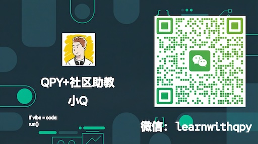

# 社区

**QPython 拥有一个活跃的技术社区，为开发者提供编程学习相关的交流、分享和互助的平台。**

## 加入社区

### QPython公众号 - 编程学习资料分享 
专注于QPython移动端开发与Python全栈技术。内容涵盖：
- ① 基础语法与进阶技巧；
- ② 趣味实战项目（爬虫、数据分析、自动化）；
- ③ 编程思维与学习方法。
定期更新，系统化学习，帮你构建完整的Python知识图谱。

### QPython B站
专注手机编程实战教学。用QPython在手机上轻松学Python，零基础也能跟上！
- ① 手把手实操演示
- ② 趣味实战项目（爬虫/自动化/小工具）
- ③ 避坑指南与技巧分享
有问必答，欢迎评论区交流，一起在手机上玩转Python！

- [B站](https://space.bilibili.com/1357778956) – 访问QPython B站

### QPython QQ论坛
专注于QPython移动端开发与Python全栈技术，为开发者提供一个作品展示、行业交流、技术沉淀的高质量交流空间。 包括以下栏目：行业资讯、技术交流、项目案例、BUG反馈。

- [QPython QQ频道](https://pd.qq.com/g/pd41382684) – 与QQ/微信用户在腾讯频道交流

### QPython微信群 & QQ群
QPython微信用户群群定位：QPython使用交流 | Python学习互助 | 实战问题解答，添加助手后会邀您加入

| 微信群（助手: learnwithqpy） | QQ群（群号: 862351102） |
|------|----------|
|  |  |

### QPython 知识星球 VIP社区
QPython官方付费VIP专属社区，为深度用户提供官方团队直连、及时技术支持、高质量交流的专属服务空间。加入VIP社区可获下列核心价值：

- 🎯 官方团队直连 —— QPython开发团队在线答疑，遇到问题不再卡壳，技术难题快速响应
- 🚀 优先技术支持 —— VIP用户专属通道，比公开渠道更快获得官方解答
- 💡 深度交流圈子 —— 与核心用户、资深开发者同行，探讨高阶技巧与项目实战

### QPython 社区推荐服务
在 QPython 的使用过程中，部分用户希望将自己开发的脚本或服务打包成独立的安卓应用。为此，我们特别筛选了以下优质服务，供您按需选择：

- [安卓应用打包 - 将您的 QPython 项目打包为安卓应用](https://pd.qq.com/s/cemomtgzg?b=2)

如果您想推荐你的 QPython 社区服务，也欢迎微信联系。
---

*QPython 团队会定期在社区中更新项目进展，欢迎关注！*
