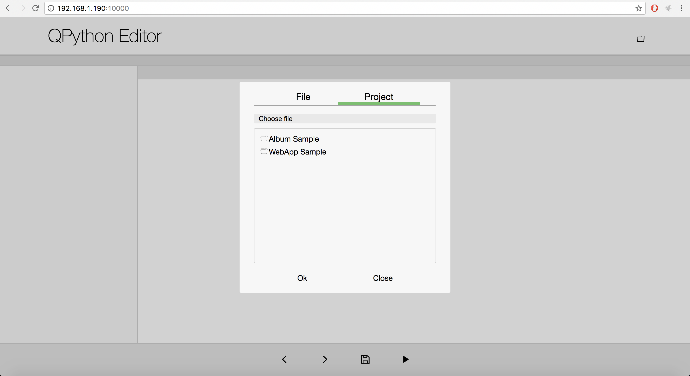

# 使用最佳开发方式

## 从 QEditor 开发

QEditor 是 QPython 的内置编辑器，支持 Python / HTML 语法高亮。

**QEditor 的主要功能**

* 编辑/查看纯文本文件，如 Python、Lua、HTML、Javascript 等

* 编辑和运行 Python 脚本 & Python 语法高亮

* 编辑和运行 Shell 脚本

* 使用内置 HTML 浏览器预览 HTML

* 按关键字搜索、代码片段、代码分享

您可以直接在 QEditor 中运行 QPython 脚本，因此在移动时这是 QPython 开发最方便的方式。

## 通过浏览器开发

QPython 有一个内置脚本 **qedit4web.py**，当您点击开始按钮并选择"运行本地脚本"时可以看到它。

运行后，您可以看到结果。

然后，您可以通过 PC/笔记本电脑的浏览器访问该网址进行开发，如下图所示。

*选择某个项目或脚本后，您可以开始开发*

借助它，您可以编写浏览器代码，然后在 Android 手机上运行。非常方便。

## 从您的电脑开发

除了上述方法，您还可以用自己的方式开发脚本，然后通过内置的 FTP 服务将其上传到手机，用 QPython 运行它。
