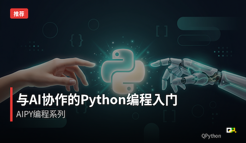

# 精选课程

在这里，我们为您介绍一些由社区成员创建的精品课程。每一门课程都凝聚了创作者的心血和独特见解，希望能为您的学习之旅带来启发和帮助。

## 与AI协作的Python编程入门 - AIPY编程系列

**课程简介：** 你是否觉得编程很难？在 AI 时代，这一切正在改变。本课程将带你掌握 Python 编程基础，同时学会与 AI 高效协作。独创 AI 辅助教学法，系统讲解 Python 核心知识，教会你如何向 AI 精确表达需求、协同调试代码。通过聊天机器人、数据分析助手等实战项目，建立人机协作工作流，让你彻底打破对代码的畏惧。

**创作故事：** 这门课是如何诞生的？以下是作者的创作手记：

- [为什么我要写一套适合初学者的 AI 协助 Python 编程教材？ - 创作手记（一）](https://mp.weixin.qq.com/s/prDO7rlAE9ofPnjTKsKObQ)
- [与 AI 协作的"拉扯"式 Python 编程课程纲领创作 - 创作手记（二）](https://mp.weixin.qq.com/s/1W_bKCgdy1UspuriamX6jA)

---

## 欢迎反馈

如果您有想法想要分享，欢迎联系我们！

- [GitHub Issues](https://github.com/qpython-android/edu.qpython.org/issues) – 提交您的课程建议
- [中文交流社区](/zh/community/) – 与其他学习者交流心得

