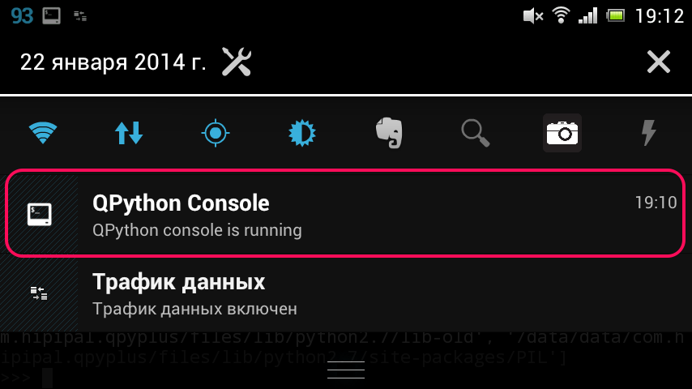

# QPython：入门指南

本指南将介绍 QPython 的功能并帮助您快速入门。

## QPython 概述

**为什么选择 QPython？**

智能手机正在成为人们必备的信息和技术助手，一个灵活的解释器引擎可以帮助人们高效地完成大部分工作，无需复杂的开发过程。

QPython 提供了 **惊人的开发体验**——借助它的帮助，您可以轻松实现程序，无需复杂的 IDE 安装、编译或打包过程。

### QPython 版本

针对不同的使用场景，QPython 有多个版本：

- **[QPython - Python 和 AI 的 IDE](qpython-x.md)** – 具有 AI 功能的主要版本，可在 Google Play 和应用商店下载
- **[QPython+ - Android 的 Python](qpython-x.md)** – 面向贡献者的社区开源版本
- **[QPython Plus](qpython-x.md)** – 扩展权限版本（不在应用商店上架）

### 主要特性

- **离线 Python 3.12 解释器** - 运行 Python 程序无需互联网
- **多种运行模式** - 控制台、SL4A、Kivy GUI、WebApp 和后台（QScript）模式
- **SL4A 集成** - 使用 Python 控制 Android 硬件和 API
- **包安装** - QPYPI 和 pip 支持以扩展功能
- **内置编辑器** - 语法高亮和代码编辑
- **二维码支持** - 方便的代码分享和分发

---

## 1. 仪表盘


安装 QPython 后，点击其图标启动。您将看到带有 QPython 标志和以下功能的主仪表盘：

### 仪表盘功能

QPython 仪表盘提供对所有主要功能的快速访问：

* **终端** — 访问 Python 控制台和 shell 以直接执行命令
* **Notebook** — 用于数据分析和实验的交互式 Jupyter 风格笔记本
* **编辑器** — 内置代码编辑器，具有语法高亮功能，用于编写 Python 脚本
* **资源管理器** — 浏览和管理您的文件、脚本和项目
* **QPYPI** — 安装 Python 包和扩展。详见 [QPYPI 指南](qpypi-guide.md)
* **设置** — 配置 QPython 首选项和运行选项
* **社区** — 访问 QPython 社区资源、论坛和帮助
* **课程** — 访问 Python 编程的学习材料和教程

点击任何图标以访问相应的功能。

---

## 2. 终端和编辑器

### 终端


终端提供一个 Python 控制台，您可以：
- 探索对象属性
- 测试语法和想法
- 直接执行命令

使用加号按钮（1）打开额外的终端标签页，从下拉菜单（2）切换它们，并使用关闭按钮（3）关闭它们。



终端运行时，通知栏中会保留一条通知。点击它可返回终端。

### 编辑器


编辑器功能：
- Python 语法高亮
- 行号
- 缩进控制（工具栏上的按钮 1）
- **保存**和**另存为**（按钮 2）
- **运行**（按钮 3）
- **撤销**、**搜索**、**最近文件**、**设置**
- **打开**和**新建**（顶部按钮 5）

**重要提示：** 保存时请手动添加 `.py` 扩展名，因为编辑器不会自动添加。

---

## 3. 资源管理器（文件管理）

通过 **资源管理器** 访问您的脚本和项目。在这里您可以浏览、组织和管理所有 Python 文件。

### 脚本

脚本是存储在 `/storage/emulated/0/Android/data/org.qpython.qpy/files/scripts3/` 中的单个 Python 文件（针对 Python 3）。

可用操作：
- **运行** — 执行脚本
- **打开** — 使用内置编辑器编辑
- **重命名** — 更改脚本名称
- **删除** — 删除脚本

### 项目

项目是包含 `main.py` 作为入口点的目录。您可以在同一目录中包含其他依赖项和资源。将项目存储在 `/storage/emulated/0/Android/data/org.qpython.qpy/files/projects3/` 中。

### 笔记本

Jupyter 风格的笔记本也通过资源管理器进行管理，存储在 `/storage/emulated/0/Android/data/org.qpython.qpy/files/notebooks/` 中。

可用操作：
- **运行** — 执行项目
- **打开** — 探索项目资源
- **重命名** — 更改项目名称
- **删除** — 删除项目

---

## 4. 库

通过安装第三方库来扩展 QPython 的功能。

### 包安装方法

**QPYPI（推荐）**

从 QPYPI 安装预编译的库，包括 numpy、scipy 等科学包。

详见 [QPYPI 指南](qpypi-guide.md)。

**PIP 客户端**

通过 QPython 的 PIP 客户端或 QPYPI 仪表盘安装纯 Python 库：

```bash
pip install requests
```

**预编译包**

对于具有 C/C++/Rust 依赖的包，使用 QPython 的预编译包：

```bash
pip install numpy-qpython
pip install scipy-aipy
```

详见 [QPYPI 指南](qpypi-guide.md) 获取可用包的完整列表。

**手动安装**

您也可以将库复制到 `/storage/emulated/0/Android/data/org.qpython.qpy/files/lib/python3.12/site-packages/`。

---

## 5. 运行模式

QPython 支持多种运行模式以满足不同的用例：

### 控制台模式

常规 Python 脚本的默认模式。

### SL4A 模式

通过 SL4A 库使用 Android API 的脚本。

```python
import androidhelper

droid = androidhelper.Android()
droid.makeToast('Hello Android!')
```

详见 [QSL4A 文档](qsl4a/index.md) 获取完整的 API 参考。

### WebApp 模式

使用后端服务器创建基于 Web 的应用程序。

在脚本中添加 headers：
```python
#qpy:webapp:Hello QPython
#qpy://localhost:8080/hello

from bottle import route, run, Bottle

app = Bottle()

@route('/hello')
def hello():
    return '<h1>Hello from QPython!</h1>'

run(app, host='localhost', port=8080)
```

### Q 模式（后台）

在后台无 UI 运行脚本。

添加 header：
```python
#qpy:quiet

import time

while True:
    # 您的后台任务
    time.sleep(60)
```

---

## 6. 社区与支持

访问 [QPython.org](http://qpython.org) 获取：
- 文档
- 用户社区
- 帮助和问答

**社区链接：**
- [Facebook 群组](https://www.facebook.com/groups/qpython)
- [GitHub](https://github.com/qpython-android/qpython)
- [问题反馈](https://github.com/qpython-android/qpython/issues)

**下一步：**
- 尝试 [Hello World 教程](tutorial-hello-world.md)
- 探索 [QSL4A API](qsl4a/index.md) 以集成 Android
- 了解 [QPython 版本](qpython-x.md)

---

*感谢 dmych 在[他的博客](http://onetimeblog.logdown.com/posts/2014/01/22/qpython-how-to-start)上提供的原始草稿*
