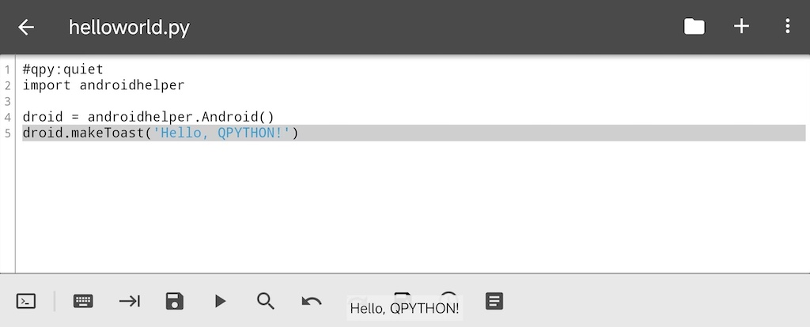

# 编写"Hello World"

## Hello world



好的，在您对 QPython 有了一定的了解之后，让我们在 QPython 中创建我们的第一个程序。显然，它将是 `helloworld.py`。;)

启动 QPython，打开编辑器并输入以下代码：

```python
#qpy:quiet
import androidhelper

droid = androidhelper.Android()
droid.makeToast('Hello, QPYTHON!')
```

毫无疑问，它与其他任何 hello-world 程序并无不同。执行时，它只是在屏幕上显示弹出消息（见顶部截图）。无论如何，这是一个很好的 QPython 程序示例。

## 代码理解

它以 *import androidhelper* 开头——这是 QPython 中最有用的模块，它封装了 Python 中可用的几乎所有与 Android 的接口。任何在 QPython 中开发的脚本都以这个语句开头（至少如果它声称要与用户通信的话）。在此处阅读更多关于 [Python 库](https://docs.python.org/3.12/library/index.html) 和 [import 语句](https://docs.python.org/3.12/reference/simple_stmts.html#import) 的内容。


接下来我们创建一个 `droid` 对象（实际上是一个类），它对于调用 RPC 函数以与 Android 通信是必要的。

我们代码的最后一行调用了这样的函数，`droid.makeToast()`，它在屏幕上显示一个小的弹出消息（"toast"）。

好的，让我们添加一些更多的功能。让它询问用户名并向用户打招呼。

## 更多示例

我们可以使用 `dialogGetInput` 调用显示一个带有标题、提示、编辑字段和 **确定** 和 **取消** 按钮的简单对话框。用以下代码替换您的最后一行代码并将其保存为 `hello1.py`：

```python
#qpy:quiet
import androidhelper

droid = androidhelper.Android()
respond = droid.dialogGetInput("Hello", "What is your name?")
```

好的，我认为它应该返回任何响应，任何用户反应。这就是为什么我写 `respond = ...`。但这个调用实际上返回什么？让我们检查一下。只需在最后一行后添加 print 语句：

```python
#qpy:quiet
import androidhelper

droid = androidhelper.Android()
respond = droid.dialogGetInput("Hello", "What is your name?")
print(respond)
```

然后保存并运行它...

哎呀！没有打印？别担心。只需拉下通知栏，您就会看到"QPython Program Output: hello1.py"——点击它！

如您所见，`droid.dialogGetInput()` 返回一个包含三个字段的 JSON 对象。我们只需要一个——`result`，其中包含用户实际输入的内容。

让我们添加脚本的反应：

```python
#qpy:quiet
import androidhelper

droid = androidhelper.Android()
respond = droid.dialogGetInput("Hello", "What is your name?")
print(respond)
message = f'Hello, {respond.result}!'
droid.makeToast(message)
```

最后两行（1）格式化消息，（2）以 toast 形式向用户显示消息。如果您仍然不知道 f-string 是什么意思，请参阅 [Python 文档](https://docs.python.org/3.12/tutorial/inputoutput.html#fancier-output-formatting)。

哇！它工作了！;)

现在我要在那里添加一些逻辑。想一想：如果用户点击 **取消** 按钮，或者点击 **确定** 但将输入字段留空，会发生什么？

您可以玩这个程序，检查 `respond` 变量在每种情况下包含什么。

首先，我想将用户输入的文本放入一个单独的变量中：`name = respond.result`。然后我检查它，如果它包含任何真实文本，它将被视为名称并用于问候。否则，将显示另一条消息。将第五行 `message = f'Hello, {respond.result}!'` 替换为以下代码：

```python
name = respond.result
if name:
    message = f'Hello, {name}!'
else:
    message = "Hey! And you're not very polite, %Username%!"
```

使用工具栏上的 **<** 和 **>** 按钮来缩进/取消缩进 if 语句中的行（或者只需使用空格/退格键）。您可以在 [此处](https://docs.python.org/3.12/tutorial/introduction.html#first-steps-towards-programming) 阅读更多关于 Python 缩进的内容；if 语句在 [此处](https://docs.python.org/3.12/tutorial/controlflow.html#if-statements) 描述。

首先，我们将用户输入放入 `name` 变量。然后我们检查 `name` 是否包含任何内容？如果用户留空行并点击 **确定**，返回值是空字符串 `''`。如果按下了 **取消** 按钮，返回值是 `None`。在 if 语句中，两者都被视为假。因此，只有当 `name` 包含任何有意义的内容时，then 语句才会执行，并显示问候语"Hello, ...!"。如果输入为空，用户将看到"Hey! And you're not very polite, %Username%!"消息。

好的，这是整个程序：

```python
#qpy:quiet
import androidhelper

droid = androidhelper.Android()
respond = droid.dialogGetInput("Hello", "What is your name?")
print(respond)
name = respond.result
if name:
    message = f'Hello, {name}!'
else:
    message = "Hey! And you're not very polite, %Username%!"
droid.makeToast(message)
```

运行效果：

<video src="../static/mov_hellolorld.mp4" controls width="480"></video>